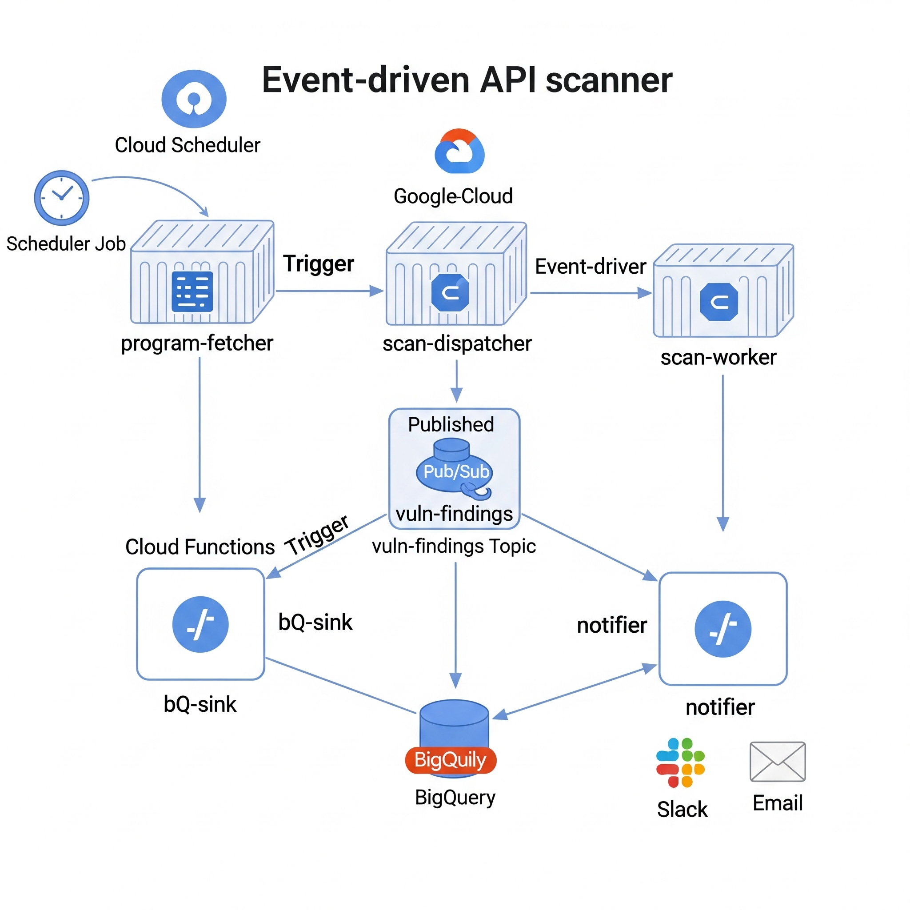

# 3rd EAI

> Event-driven API/web scanner with automated scope discovery, AI/ML signal integration, and a push-based findings pipeline.



## ✨ Features

* **FastAPI-based Dispatcher/Worker**: Supports `/scan/url` and related endpoints for efficient scanning.
* **Autonomous Scope Discovery**: Uses `program-fetcher` to identify in-scope assets.
* **ML/AI Signal Integration**: Optional AI-powered analysis with configurable confidence thresholds.
* **Push-based Findings Pipeline**: Publishes findings to Pub/Sub, stores in BigQuery, and sends Slack notifications.
* **24x7 Operation**: Orchestrated by Cloud Scheduler, running every 10 minutes (configurable).

## 🧩 Architecture

```
Cloud Scheduler ─────────┐                   ┌──> Cloud Function: bq-sink ───> BigQuery (vuln_data.findings)
                         │                   │
   (every 10 min)        │                   └──> Cloud Function: notifier ──> Slack / Email
                         ▼
                 Cloud Run: program-fetcher ──POST /sync──┐
                                                          │
                                                          ▼
               Cloud Run: scan-dispatcher ──POST /scan/url───► Cloud Run: scan-worker
                                                          │
                                                          ▼
                                                 Pub/Sub topic: vuln-findings
```

## 🔌 API Endpoints (Worker)

* `GET /health` (may require authentication)
* `POST /scan/url` – Primary scan endpoint
* Additional endpoints in codebase: `/scan/report`, `/scan/url_report`, `/scan/postman`

For detailed request/response bodies, refer to the source code.

### cURL Examples

**Kick off a Scan Manually:**

```bash
curl -sS -X POST "$DISPATCHER_URL/scan/url" \
  -H "Content-Type: application/json" \
  -d '{"url":"https://cloud.google.com","max_pages":2,"ai_ml":true}'
```

**Worker Health Check (authenticated):**

```bash
curl -sS -H "Authorization: Bearer $(gcloud auth print-identity-token \
  --impersonate-service-account="scanner-sa@$PROJECT.iam.gserviceaccount.com" \
  --audiences="$WORKER_URL")" \
  "$WORKER_URL/health"
```

## ⚙️ Configuration

### Environment Variables

Create a `.env` file (never commit secrets) with placeholders:

```plaintext
# Integrations (optional)
HACKERONE_API_TOKEN=YOUR_H1_TOKEN
INTIGRITI_API_TOKEN=YOUR_INTIGRITI_TOKEN

# Security
JWT_SECRET=change_me_in_prod
CORS_ORIGINS=["http://localhost:3000","https://localhost:3000"]

# Scanning
MAX_CONCURRENT_SCANS=50
SCAN_TIMEOUT=3600
AI_CONFIDENCE_THRESHOLD=0.8

# ML
MODEL_CACHE_DIR=./models
CUDA_VISIBLE_DEVICES=0

# Notifications (Cloud Function: notifier)
SLACK_WEBHOOK_URL=https://hooks.slack.com/services/XXX/YYY/ZZZ
ALERT_EMAIL_TO=
```

## 🚀 Getting Started

### Prerequisites

* **Google Cloud CLI (`gcloud`)**: Authenticated with billing enabled.
* **Python** 3.10+ for local development.

### 1. GCP Setup

#### Enable APIs

```bash
gcloud services enable run.googleapis.com \
  cloudbuild.googleapis.com \
  artifactregistry.googleapis.com \
  pubsub.googleapis.com \
  cloudscheduler.googleapis.com \
  cloudfunctions.googleapis.com \
  bigquery.googleapis.com \
  iam.googleapis.com
```

#### Service Account

Create `scanner-sa` and assign minimal roles:

```bash
gcloud iam service-accounts create scanner-sa \
  --display-name "Scanner Service Account"

# Cloud Run invoke + run services
gcloud projects add-iam-policy-binding $PROJECT \
  --member="serviceAccount:scanner-sa@$PROJECT.iam.gserviceaccount.com" \
  --role="roles/run.invoker"

# Pub/Sub publish/consume
gcloud projects add-iam-policy-binding $PROJECT \
  --member="serviceAccount:scanner-sa@$PROJECT.iam.gserviceaccount.com" \
  --role="roles/pubsub.publisher"
gcloud projects add-iam-policy-binding $PROJECT \
  --member="serviceAccount:scanner-sa@$PROJECT.iam.gserviceaccount.com" \
  --role="roles/pubsub.subscriber"

# BigQuery write (for bq-sink CF)
gcloud projects add-iam-policy-binding $PROJECT \
  --member="serviceAccount:scanner-sa@$PROJECT.iam.gserviceaccount.com" \
  --role="roles/bigquery.dataEditor"
gcloud projects add-iam-policy-binding $PROJECT \
  --member="serviceAccount:scanner-sa@$PROJECT.iam.gserviceaccount.com" \
  --role="roles/bigquery.jobUser"
```

#### Pub/Sub

```bash
gcloud pubsub topics create vuln-findings
```

#### BigQuery

Create dataset and table:

```bash
bq --location=US mk -d ${PROJECT}:vuln_data

bq mk --table ${PROJECT}:vuln_data.findings \
  program:STRING, \
  scope_url:STRING, \
  analysis_title:STRING, \
  analysis_severity:STRING, \
  vrt_category:STRING, \
  confidence:FLOAT, \
  recommended_fix:STRING, \
  evidence:STRING, \
  raw_event:STRING, \
  created_at:TIMESTAMP
```

### 2. Deploy Services (Cloud Run)

Deploy the three services: `scan-dispatcher`, `scan-worker`, `program-fetcher`.

#### Dispatcher

```bash
gcloud run deploy scan-dispatcher \
  --source ./services/scan-dispatcher \
  --service-account scanner-sa@$PROJECT.iam.gserviceaccount.com \
  --set-env-vars APP_ROLE=scan-dispatcher
```

#### Worker

```bash
gcloud run deploy scan-worker \
  --source ./services/scan-worker \
  --service-account scanner-sa@$PROJECT.iam.gserviceaccount.com
```

#### Program Fetcher

```bash
gcloud run deploy program-fetcher \
  --source ./services/program-fetcher \
  --service-account scanner-sa@$PROJECT.iam.gserviceaccount.com
```

Fetch service URLs:

```bash
DISPATCHER_URL=$(gcloud run services describe scan-dispatcher --format='value(status.url)')
WORKER_URL=$(gcloud run services describe scan-worker --format='value(status.url)')
PF_URL=$(gcloud run services describe program-fetcher --format='value(status.url)')
```

Update dispatcher with worker URL:

```bash
gcloud run services update scan-dispatcher \
  --set-env-vars APP_ROLE=scan-dispatcher,WORKER_URL="$WORKER_URL",WORKER_PATH="/scan/url"
```

(Optional) Keep services warm and increase timeouts:

```bash
gcloud run services update scan-dispatcher --min-instances=1 --timeout=300
gcloud run services update scan-worker      --min-instances=1 --timeout=300
gcloud run services update program-fetcher  --min-instances=1 --timeout=300
```

#### IAM

Grant invocation permissions:

```bash
for SVC in scan-dispatcher scan-worker program-fetcher bq-sink notifier; do
  gcloud run services add-iam-policy-binding $SVC \
    --member="serviceAccount:scanner-sa@$PROJECT.iam.gserviceaccount.com" \
    --role="roles/run.invoker"
  gcloud run services add-iam-policy-binding $SVC \
    --member="serviceAccount:pubsub-push@$PROJECT.iam.gserviceaccount.com" \
    --role="roles/run.invoker"
done
```

### 3. Cloud Functions (Gen 2)

#### Notifier (Pub/Sub → Slack)

- Source: `functions/notifier`
- Entry point: `handler(event: CloudEvent)`
- Sample handler (Python 3.11):

```python
import base64, json, os, requests
from cloudevents.http import CloudEvent

SLACK_WEBHOOK = os.getenv("SLACK_WEBHOOK_URL", "")

SEVERITIES = {"high","medium","low"}  # ignore info/noise

def handler(event: CloudEvent):
    msg = event.data.get("message", {})
    data = base64.b64decode(msg.get("data", b"")).decode("utf-8")
    finding = json.loads(data)

    sev = (finding.get("analysis",{}).get("severity") or "medium").lower()
    if sev not in SEVERITIES:
        return

    a = finding.get("analysis", {})
    text = (
        f"*{sev.upper()}* [{finding.get('program')}] {a.get('title')}\n"
        f"VRT: {a.get('vrt_category')} (conf {a.get('confidence',0):.2f})\n"
        f"Scope: {finding.get('scope_url')}\n"
        f"Fix: {a.get('recommended_fix','')}"
    )
    if SLACK_WEBHOOK:
        requests.post(SLACK_WEBHOOK, json={"text": text})
```

Deploy:

```bash
gcloud functions deploy notifier \
  --region=us-central1 \
  --runtime=python311 \
  --entry-point=handler \
  --trigger-topic=vuln-findings \
  --service-account="scanner-sa@$PROJECT.iam.gserviceaccount.com" \
  --set-env-vars "SLACK_WEBHOOK_URL=$SLACK_WEBHOOK_URL"
```

#### BigQuery Sink (Pub/Sub → BQ)

- Source: `functions/bq_sink`
- Entry point: `handler(event: CloudEvent)`

Deploy:

```bash
gcloud functions deploy bq-sink \
  --region=us-central1 \
  --runtime=python311 \
  --entry-point=handler \
  --trigger-topic=vuln-findings \
  --service-account="scanner-sa@$PROJECT.iam.gserviceaccount.com" \
  --set-env-vars "BQ_TABLE=$PROJECT.vuln_data.findings"
```

### 4. Cloud Scheduler (Every 10 Minutes)

Set up two jobs:

```bash
# Program fetcher -> /sync
gcloud scheduler jobs update http fetch-chaos-hourly \
  --location us-central1 \
  --schedule="*/10 * * * *" \
  --uri "$PF_URL/sync" \
  --http-method POST

# Dispatcher -> /scan/url
gcloud scheduler jobs update http program-fetcher-hourly \
  --location us-central1 \
  --schedule="*/10 * * * *" \
  --uri "$DISPATCHER_URL/scan/url" \
  --http-method POST \
  --headers "Content-Type=application/json" \
  --message-body '{"url":"https://example.com","max_pages":1,"ai_ml":true}'
```

Confirm:

```bash
gcloud scheduler jobs list --location us-central1
```

Trigger immediately:

```bash
gcloud scheduler jobs run fetch-chaos-hourly    --location us-central1
gcloud scheduler jobs run program-fetcher-hourly --location us-central1
```

## 📊 Query Recent Findings (BigQuery)

```bash
bq query --nouse_legacy_sql \
'SELECT program, analysis_title, analysis_severity, created_at
   FROM `'${PROJECT}'.vuln_data.findings`
  ORDER BY created_at DESC
  LIMIT 20'
```

## 🔍 Observability

View logs:

```bash
gcloud beta run services logs tail scan-dispatcher --region us-central1
gcloud beta run services logs tail scan-worker      --region us-central1
gcloud beta run services logs tail program-fetcher  --region us-central1

gcloud beta functions logs read notifier --region us-central1 --limit 50
gcloud beta functions logs read bq-sink  --region us-central1 --limit 50
```

Health checks: Use `GET /health` on each service (worker may return 401/403 if restricted; use Identity Tokens).

## 🧹 Cloud Tasks (Optional)

If using Cloud Tasks and the worker path changed to `/scan/url`, ensure old tasks aren’t hitting `/scan`:

```bash
gcloud tasks queues list --location us-central1
gcloud tasks list --location us-central1 --queue api-scan-queue

# Inspect task URL
gcloud tasks describe TASK_ID --queue=api-scan-queue --location=us-central1 \
  --format='value(httpRequest.url)'

# Delete stale task
gcloud tasks delete TASK_ID --queue=api-scan-queue --location=us-central1
```

Create a new task (example):

```bash
gcloud tasks create-http-task my-once-task \
  --location=us-central1 \
  --queue=api-scan-queue \
  --url="$WORKER_URL/scan/url" \
  --method=POST \
  --body-content='{"url":"https://example.com","max_pages":1}'
```

## 🧪 Local Development

```bash
python3 -m venv .venv && source .venv/bin/activate
pip install -r requirements.txt

# Run dispatcher
uvicorn services.scan_dispatcher.main:app --reload --port 8081

# Run worker
uvicorn services.scan_worker.main:app --reload --port 8082
```

Update `.env` as needed for local runs.

## 🔒 Security Notes

* Never commit secrets. Use Secret Manager or CI/CD substitutions.
* Restrict Cloud Run invocation to trusted service accounts (`scanner-sa`, Pub/Sub push).
* Keep worker health/docs private; test with Identity Tokens.
* Rotate API tokens regularly; treat client-side key matches as critical until verified.

## 🧰 Troubleshooting

* **Container failed to start / PORT=8080**: Cloud Run sets `PORT` automatically; avoid overriding. Ensure your server listens on `PORT`.
* **FastAPI.__call__() missing ... 'send'**: Indicates ASGI/WSGI mismatch. Use Uvicorn for ASGI apps.
* **/scan returning 404 from Cloud Tasks**: Worker uses `/scan/url`. Delete stale tasks or recreate with correct path.
* **Notifier CF error TypeError: handler() takes 1 positional argument but 2 were given**: Ensure Pub/Sub trigger (Gen 2) with `handler(event: CloudEvent)`. HTTP triggers use `(request, context)`.
* **403 on /health**: Service requires authenticated invocation. Use Identity Token with correct audience (service URL).

## 📄 License

MIT License.

## 🤝 Acknowledgements

* FastAPI, Uvicorn
* Google Cloud Run, Pub/Sub, Scheduler, Functions, BigQuery
